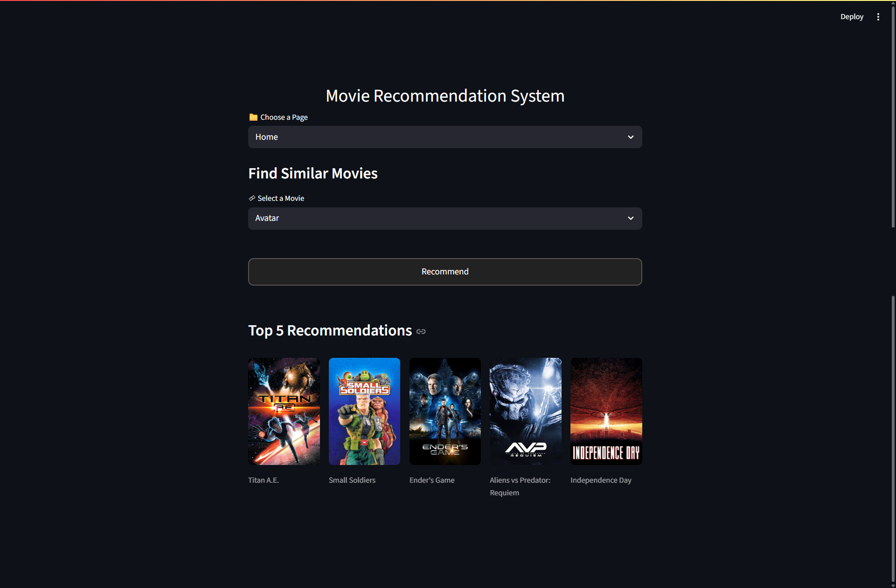
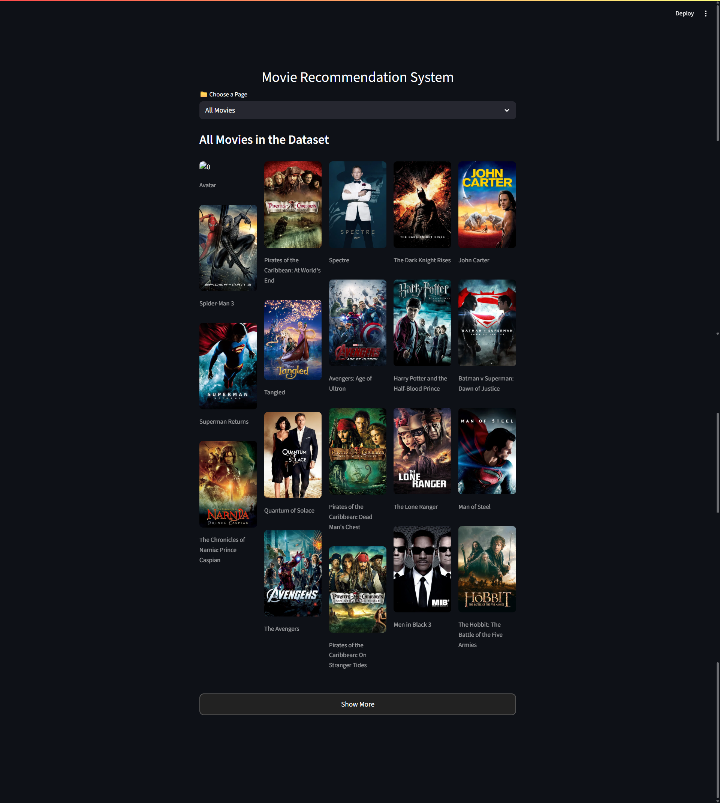

<center> 
<h1> MOVIES RECOMMENDATIONS SYSTEM </h1>

<i>Discover Your Next Favorite Movie Instantly </i>

**Built with the tools and technologies:**</center>


---

## 🧠 Overview

**Movies-Recommendations -** is a versatile developer toolkit for building and deploying personalized movie recommendation systems. It combines data processing, feature extraction, and model serialization with an interactive web interface, enabling efficient testing and visualization of predictive models.

### 🎯 Why Movies-Recommendations ?

This project simplifies the development of content-based recommender engines. The core features include:

- **Data Processing & Feature Extraction**  
  _Facilitates efficient handling of movie data, supporting text analysis and classification tasks._

- **Content-Based Recommendations**  
  _Uses item attributes to generate personalized suggestions, enhancing user engagement._

- **Interactive Web Interface**  
  _Built with Streamlit, it allows users to browse movies, view details, and explore recommendations seamlessly._

- **API Integration**  
  _Incorporates external APIs for movie posters and backgrounds, enriching the user experience._

- **Model Development & Serialization**  
  _Supports model training, transformation, and deployment within a streamlined pipeline._

---

## 🚀 Getting Started

### 📦 Prerequisites

This project requires the following dependencies:

- **Programming Language**: Python (Jupyter Notebook)
- **Package Manager**: Pip

---

### 🛠 Installation

Build **Movies-Recommendations-** from the source and install dependencies:

```bash
# Clone the repository
git clone https://github.com/Jitendra7073/Movies-Recommended-System.git
```

```bash
# Navigate to the project directory
cd Movies-Recommended-System
```

```bash
# Install the dependencies
pip install -r requirements.txt
```

---

## Usage

Run the project with:

```bash
# for app.py
streamlit run app.py
```

## 🖼️ Preview

Here's a preview of the system interface:

#### Home page


#### All Movies page (Total 5000 movies)

